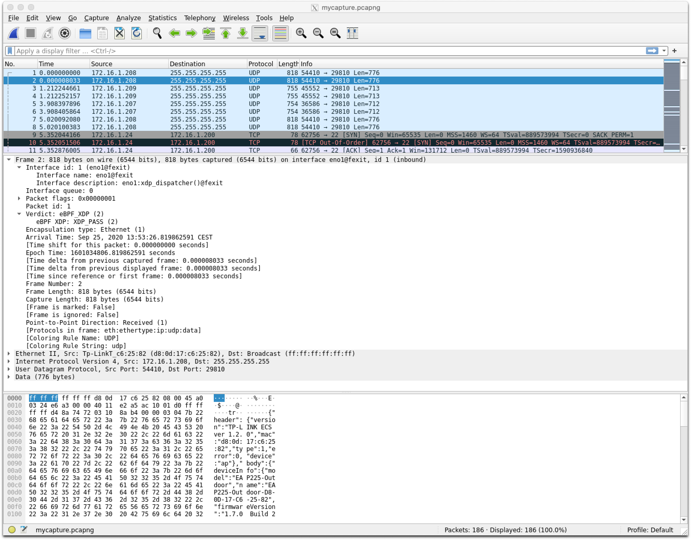
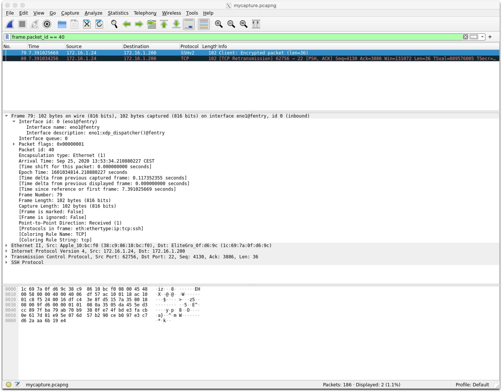

# Capturing network traffic in an eXpress Data Path (XDP) environment

## What is the eXpress Data Path (XDP) 

In short, this is a Linux kernel networking feature that allows an [extended BPF (eBPF)](https://lwn.net/Articles/740157/) program to run right before the network device hands it off to the Kernel networking stack. This eBPF program can also make modifications to the packet and decides what happens next, for example, continue kernel processing, drop the packet, or redirect it to another interface.

For more details on XDP, and eBPF take a look at the following blogs:

* [Achieving high-performance, low-latency networking with XDP](https://developers.redhat.com/blog/2018/12/06/achieving-high-performance-low-latency-networking-with-xdp-part-1/)
* [Using eXpress Data Path (XDP) maps in RHEL ](https://developers.redhat.com/blog/2018/12/17/using-xdp-maps-rhel8/)
* [Using the eXpress Data Path (XDP) in Red Hat Enterprise Linux 8 ](https://www.redhat.com/en/blog/using-express-data-path-xdp-red-hat-enterprise-linux-8)


## Why do we need xdpdump

What is wrong with using `tcpdump` for capturing network traffic in this environment? Well, if you are interested in what the kernel sees, using `tcpdump` makes perfect sense. 

However, as explained above, an XDP program can modify the packet before passing it on to the kernel. In this case, the packet's content seen by the Linux kernel is not the same as received on the wire. An XDP program can also decide to drop or redirect the packet, in which case the kernel, hence `tcpdump`, does not see the packet at all.

Here is where `xdpdump` fits in, it can be used for debugging XDP programs that are already loaded on an interface. Packets can be dumped/inspected before, on *entry* to XDP program, or/and after, at *exit* from an XDP program. Furthermore, at *exit*, the XDP action is also captured. This means that even packets that are dropped or redirected at the XDP layer can be captured via this tool.


## How does xdpdump work

The Linux Kernel has a general framework that allows an eBPF program to be attached to any kernel function entry or exit point. Recently this has been extended to allow attachment to another eBPF program. `xdpdump` uses this to gain access to the packet resources right before and after the XDP program is executed.


The above allows `xdpdump` to capture the original packet at ingress, but also the modifications the XDP program has made to the packet after execution.

`xdpdump` will capture and store the following information by default:

* The receiving interface 
* The receiving interface queue
* The original packet
* The packet after the XDP program was executed
* The XDP program's return code, i.e. `XDP_DROP`, `XDP_PASS`, etc. etc.
* A unique packet identifier to match the original packet to the packet after execution

This information is stored in a [new extension](https://github.com/pcapng/pcapng/commit/eb9f9415b7142a4a19a3d825883f3579fa301) to the pcapng file format. Support for this has been added to [Wireshark](https://code.wireshark.org/review/#/c/37412/), but as of this writing is not yet available in a release version, so using it requires compiling Wireshark from git sources (see appendix below).

## How to use xdpdump

First of all, you need to get a copy of `xdpdump`, which is part of the [*xdp-tools*](https://github.com/xdp-project/xdp-tools) project and can be found on [GitHub](https://github.com/xdp-project/xdp-tools). Some distributions like [Fedora](https://getfedora.org) and the upcoming [Red Hat Enterprise Linux 8.3](https://www.redhat.com/en/blog/red-hat-enterprise-linux-83-beta-now-available-delivers-production-stability-plus-enterprise-innovation) release support *xdp-tools* as a package.

Once installed, `xdpdump` has the following options:

```
$ ./xdpdump -h


Usage: xdpdump [options]

 XDPDump tool to dump network traffic

Options:
     --rx-capture <mode>    Capture point for the rx direction (valid values: entry,exit)
 -D, --list-interfaces      Print the list of available interfaces
 -i, --interface <ifname>   Name of interface to capture on
     --perf-wakeup <events>  Wake up xdpdump every <events> packets
 -p, --program-names <prog>  Specific program to attach to
 -P, --promiscuous-mode     Open interface in promiscuous mode
 -s, --snapshot-length <snaplen>  Minimum bytes of packet to capture
     --use-pcap             Use legacy pcap format for XDP traces
 -w, --write <file>         Write raw packets to pcap file
 -x, --hex                  Print the full packet in hex
 -v, --verbose              Enable verbose logging (-vv: more verbose)
     --version              Display version information
 -h, --help                 Show this help

```

Here are some of the options that are not self-explanatory. For the full list, check out the [man page](https://github.com/xdp-project/xdp-tools/blob/master/xdp-dump/README.org):

#### --rx-capture <mode>
Specify where the ingress packet gets captured. Either at the entry of the XDP program and/or exit of the XDP program. Valid options are **entry**, **exit**,
or both **entry,exit**. The packet at **exit** can be modified by the XDP program. If you are interested to see both the original and modified packet,
use the **entry,exit** option. With this, each packet is captured twice. The
default value for this is **entry**.

#### --perf-wakeup <events>                                    
Let the Kernel wake up `xdpdump` once for every `events` being posted in the perf ring buffer. The higher the number the less the impact is on the actual XDP program. The default value is 0, which automatically calculates the value based on the available CPUs/buffers. Use -v to see the actual used value.

#### -p, --program-names <prog>
The Linux API does not provide the full name of the attached eBPF entry function
if it's longer than 15 characters. `xdpdump` will try to guess the correct function name from the available BTF debug information. However, if multiple functions exist with the same leading name, it can not pick the correct one. It will dump the available functions, and you can choose the correct one, and supply it with this option.

#### --use-pcap
Use legacy pcap format for XDP traces. By default, it will use the PcapNG format so that it can store various metadata.


### Some examples:

The below will load the `xdp-filter` program, which is also part of *xdp-tools*, on `eno1`, but it does not do any actual filtering:

```
# xdp-filter load --mode skb eth0

# xdpdump -D
if_index  if_name           XDP program entry function
--------  ----------------  --------------------------------------------------
1         lo                <No XDP program loaded!>
2         eno1              xdp_dispatcher()
                              xdpfilt_alw_all()
```

Now we can try `xdpdump`:

```
# ./xdpdump -i eno1 -x --rx-capture entry,exit
listening on eno1, ingress XDP program ID 132 func xdp_dispatcher, capture mode entry/exit, capture size 262144 bytes
1601027763.302161077: @entry: packet size 60 bytes, captured 60 bytes on if_index 2, rx queue 0, id 1
  0x0000:  ff ff ff ff ff ff 00 02 d1 19 47 bd 08 06 00 01  ..........G.....
  0x0010:  08 00 06 04 00 01 00 02 d1 19 47 bd ac 10 01 cb  ..........G.....
  0x0020:  ff ff ff ff ff ff ac 10 01 cb 00 00 00 00 00 00  ................
  0x0030:  00 00 e0 00 00 00 05 00 00 00 04 00              ............
1601027763.302167163: @exit[PASS]: packet size 60 bytes, captured 60 bytes on if_index 2, rx queue 0, id 1
  0x0000:  ff ff ff ff ff ff 00 02 d1 19 47 bd 08 06 00 01  ..........G.....
  0x0010:  08 00 06 04 00 01 00 02 d1 19 47 bd ac 10 01 cb  ..........G.....
  0x0020:  ff ff ff ff ff ff ac 10 01 cb 00 00 00 00 00 00  ................
  0x0030:  00 00 e0 00 00 00 05 00 00 00 04 00              ............
^C
2 packets captured
0 packets dropped by perf ring
```

Above, you see the same packet captured twice, at ingress, and after the XDP program has been executed. You also see the return code after execution, `@exit[PASS]`. The *id* value, `id 1`, can be used to correlate the packets if they are not processed in order, for example, when multiple CPUs process packets from the same NIC but from different queues.

Below are two more examples redirecting the capture file to `tcpdump` or `tshark`, which allows real-time packet decoding:

```
# xdpdump -i eno1 -w - | tcpdump -r - -n
listening on eno1, ingress XDP program xdpfilt_dny_all, capture mode entry, capture size 262144 bytes
reading from file -, link-type EN10MB (Ethernet)
15:55:09.075887 IP 192.168.122.1.40928 > 192.168.122.100.ssh: Flags [P.], seq 3857553815:3857553851, ack 3306438882, win 501, options [nop,nop,TS val 1997449167 ecr 1075234328], length 36
15:55:09.077756 IP 192.168.122.1.40928 > 192.168.122.100.ssh: Flags [.], ack 37, win 501, options [nop,nop,TS val 1997449169 ecr 1075244363], length 0
15:55:09.750230 IP 192.168.122.1.40928 > 192.168.122.100.ssh: Flags [P.], seq 36:72, ack 37, win 501, options [nop,nop,TS val 1997449842 ecr 1075244363], length 36
```

```
# xdpdump -i eno1 -w - | tshark -r - -n
listening on eno1, ingress XDP program xdpfilt_dny_all, capture mode entry, capture size 262144 bytes
    1   0.000000 192.168.122.1 → 192.168.122.100 SSH 102 Client: Encrypted packet (len=36)
    2   0.000646 192.168.122.1 → 192.168.122.100 TCP 66 40158 → 22 [ACK] Seq=37 Ack=37 Win=1467 Len=0 TSval=1997621571 TSecr=1075416765
    3  12.218164 192.168.122.1 → 192.168.122.100 SSH 102 Client: Encrypted packet (len=36)
```


## Analyze capture files with Wireshark

First let's just capture a bunch of packets through `xdpdump`:

```
# xdpdump -i eno1 --rx-capture entry,exit -w mycapture.pcapng
listening on eno1, ingress XDP program ID 132 func xdp_dispatcher, capture mode entry/exit, capture size 262144 bytes
^C
186 packets captured
0 packets dropped by perf ring
```

First lets see what meta-data `xdpdump` adds to the PcapNG file:

```
capinfos ~/mycapture.pcapng 
File name:           /home/echaudron/pcapng/mycapture.pcapng
File type:           Wireshark/... - pcapng
File encapsulation:  Ethernet
File timestamp precision:  nanoseconds (9)
Packet size limit:   file hdr: (not set)
Number of packets:   186
File size:           52kB
Data size:           38kB
Capture duration:    16.842188367 seconds
First packet time:   2020-09-25 13:53:26.819854558
Last packet time:    2020-09-25 13:53:43.662042925
Data byte rate:      2,266 bytes/s
Data bit rate:       18kbps
Average packet size: 205.24 bytes
Average packet rate: 11 packets/s
SHA256:              e4a617b29ad6cb91c8fac39dbaf11410063c2329b43ae596d785479c8478ff22
RIPEMD160:           c8ff9b9a6aa7729e722d00da1fe65c7d4e3097a0
SHA1:                c13c0a19b1cc3d5a7a967135524ba21fffca3806
Strict time order:   True
Capture hardware:    x86_64
Capture oper-sys:    Linux ebuild 5.8.7-200.fc32.x86_64 #1 SMP Mon Sep 7 15:26:10 UTC 2020
Capture application: xdpdump v1.0.1
Number of interfaces in file: 2
Interface #0 info:
                     Name = eno1@fentry
                     Description = eno1:xdp_dispatcher()@fentry
                     Encapsulation = Ethernet (1 - ether)
                     Hardware = driver: "e1000e", version: "3.2.6-k", fw-version: "0.6-4", rom-version: "", bus-info: "0000:00:1f.6"
                     Speed = 1000000000
                     Capture length = 0
                     Time precision = nanoseconds (9)
                     Time ticks per second = 1000000000
                     Time resolution = 0x09
                     Number of stat entries = 0
                     Number of packets = 93
Interface #1 info:
                     Name = eno1@fexit
                     Description = eno1:xdp_dispatcher()@fexit
                     Encapsulation = Ethernet (1 - ether)
                     Hardware = driver: "e1000e", version: "3.2.6-k", fw-version: "0.6-4", rom-version: "", bus-info: "0000:00:1f.6"
                     Speed = 1000000000
                     Capture length = 0
                     Time precision = nanoseconds (9)
                     Time ticks per second = 1000000000
                     Time resolution = 0x09
                     Number of stat entries = 0
                     Number of packets = 93
```

As you can see, it will add some general information about the host where it was captured and the `xdpdump` version. But more of interest are the two interfaces. There is one for packets that arrive on the interface, i.e. before the XDP program is executed, `eno1@fentry`, and one after the program was executed, `eno1@fexit`. The description also holds details on the XDP function name, `eno1:xdp_dispatcher()@fentry`.


Now open up *Wireshark* and explore the packets:



In the picture above, we have selected the second packet, which is a @exit packet. If you take a good look, you can identify all the meta-data fields:

* The receiving interface (and the comment with the XDP program function): `Interface Name`, `Interface description`
* The receiving interface's queue: `Interface queue`
* The unique packet ID: `Packet id`
* The XDP return code: `Verdict => eBP XDP:`

But this not where the functionality ends. You can use these fields to build packet filters. For example, the picture below shows how to filter packets with unique packet id 40:



Some more example of interesting filters:

* All XDP_REDIRECT or XDP_TX packets: `frame.verdict.ebpf_xdp == 4 || frame.verdict.ebpf_xdp == 3`
* All packets from a specific interface: `frame.interface_name== "eno1@fexit"`
* All packets from a specific interface queue: `frame.interface_queue == 2`

## Conclusion
As you can see in the above examples, `xdpdump` does not have any filtering support like `tcpdump`. This is a feature on the roadmap but has not yet been implemented (see below). Nevertheless, `xdpdump` is a valuable tool, especially when troubleshooting XDP related issues. For example, when packets are not received on the interface, are they dropped by XDP? Or why does my packet look odd (or is even rejected by the kernel)? Is this because XDP corrupted it?

The above is a tour of the current features of `xdpdump`, but we would like to add more, such as native capture filter support. See the [roadmap](https://github.com/xdp-project/xdp-tools/milestone/2) for details.


## Appendix: Build latest Wireshark with the PcapNG extensions

This chapter explains how to quickly build and use the latest *Wireshark* from the Git repository. This is needed to explore the examples in the [Analyze capture files with *Wireshark*](#analyze-capture-files-with-wireshark) section until the next major release of *Wireshark* is available.


On my Fedora 32 build system, already used to build the Linux Kernel, I had to install at least the following packages to build Wireshark:

- c-ares-devel
- cmake
- glib2-devel
- libgcrypt-devel
- libssh-devel
- ninja-build
- qt5
- qt5-devel
- systemd-devel

The `cmake` command below will report which mandatory packages are missing, and will also show a list of optional packages it's missing.

Checkout the master tree:

```
$ git clone https://gitlab.com/wireshark/wireshark.git
Cloning into 'wireshark'...
remote: Enumerating objects: 201, done.
remote: Counting objects: 100% (201/201), done.
remote: Compressing objects: 100% (126/126), done.
remote: Total 614344 (delta 109), reused 152 (delta 75), pack-reused 614143
Receiving objects: 100% (614344/614344), 584.73 MiB | 25.01 MiB/s, done.
Resolving deltas: 100% (491564/491564), done.
```

Build it:

```
$ mkdir wireshark-ninja

$ cd wireshark-ninja

$ cmake -G Ninja ../wireshark
-- The C compiler identification is GNU 10.2.1
-- The CXX compiler identification is GNU 10.2.1
-- Check for working C compiler: /usr/lib64/ccache/cc
-- Check for working C compiler: /usr/lib64/ccache/cc - works
...
...
-- Generating done
-- Build files have been written to: /home/echaudron/Documents/Scratch/wireshark-ninja

$ ninja
[2392/2392] Linking CXX executable run/wireshark
```

Run it from the wireshark-ninja directory:

```
$ ./run/wireshark
```
 

For additional details/help see the [Wireshark Developer’s Guide](https://www.wireshark.org/docs/wsdg_html_chunked/).


